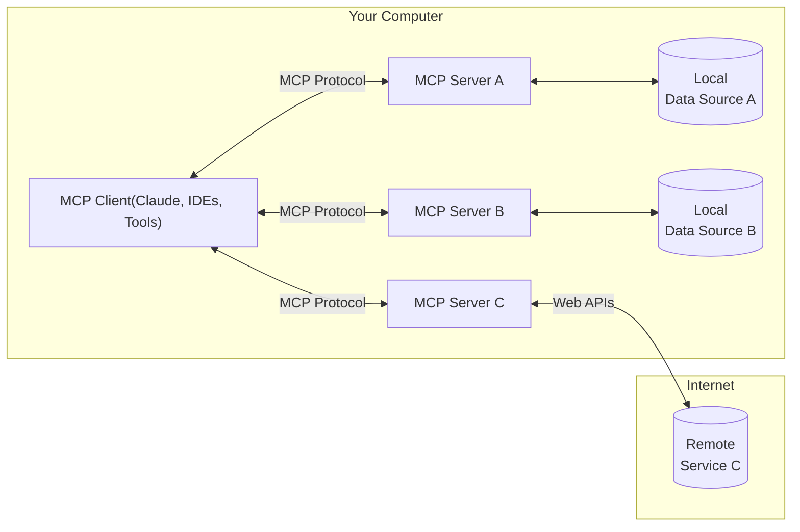
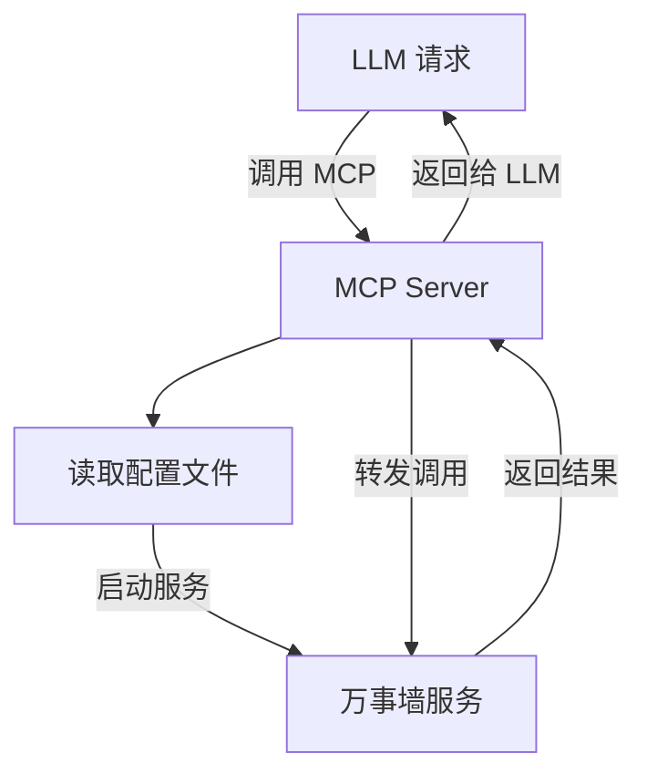

# [MCP 是什么以及它为何重要]{style="color:#e3e3e3;font-size:4rem;"} 

<span class="text-sm text-gray-400">
起量加 @马启骞
</span>

<!--
今天要分享的内容是
- mcp 是什么
- mcp 的实践
- 创建人工智能和应用程序之间的通用语言的标准
-->

---
class: "text-left"
---

# 什么是 MCP（Model Context Protocol）？

<v-click>

MCP（Model Context Protocol，模型上下文协议） ，2024年11月底，由 Anthropic 推出的一种**开放标准**，旨在统一大型语言模型（LLM）与外部数据源和工具之间的**通信协议**
<br />

</v-click>

<div class="flex justify-between gap-4">
  <div v-click >

  {width=600px height=200px}

  </div>

  <div v-click="'+1'" class="mt-8">

  - 🤖 LLM = 主机
  - 📦 上下文 / 工具  = 外设
  - 🧩 MCP = 标准化协议，负责描述「怎么连接」+「能干啥」
  > MCP 就像是大模型的「USB 接口」

  </div>
</div>

<!--
[click] 
什么是 MCP

[click]
MCP 的架构如图组成

- MCP Hosts: 这些是需要访问外部数据或工具的应用程序（如 Claude Desktop 或 AI 驱动的 IDE）

- MCP Clients: 它们维护与 MCP 服务器的专用、一对一连接

- MCP Servers: 轻量级的服务器通过 MCP 暴露特定的功能，连接到本地或远程数据源

- 本地数据源: 由 MCP 服务器安全访问的文件、数据库或服务

总之，，MCP 允许 AI 助手使用通用语言与各种软件工具进行通信

[click]
如果把这套协作方式看成你的电脑，那么

- LLM （图上的 client）就是你的主机
- MCP server 就是你的外设
- MCP 就是大模型的 USB 接口
-->

---

# MCP 整体架构

<br/>



<!--
- MCP 主机：像 Claude Desktop、IDE 或 AI 工具这样的程序，需要通过 MCP 访问数据
- MCP 客户端：与服务器保持 1:1 连接的协议客户端
- MCP 服务器：轻量级程序，每个程序都通过标准化模型上下文协议公开

特定功能
- 本地数据源：MCP 服务器可以安全访问的您计算机上的文件、数据库和服务
- 远程服务：MCP 服务器可以通过互联网（例如通过 API）连接到的外部系统
-->


---

# 有了 MCP 之后，我们能做什么？

<br/>

<v-clicks>

- <mdi-folder /> 访问本地文件系统  
  读取访问本地文件目录、将 LLM 输出创建为文件、编辑文件

- <material-symbols-cloud-sync-rounded /> 访问远程服务  
  调用公司内网 API、集成飞书接口、集成内部 mis 平台

- <mdi-database /> 访问数据库  
  查询用户行为数据、统计日报、更新数据表、执行审批流记录入库

- <mdi-web /> 访问网页  
  抓取网页正文、提取链接、爬取搜索结果用于辅助问答

- <material-symbols-hub-outline /> 访问其他工具  

</v-clicks>

---
scale: 0.8
---

# MCP 实际应用 – 万事墙查询

<br/>

<div 
  v-if="$clicks < 2"
  v-click
  flex="items-center justify-center" 
  transition duration-500 
  forward:delay-500 
  pb-10
  class="translate-x-35"
>
  <SlidevVideo controls autoplay class="h-[420px]">
    <source src="/mcp-demo-record.mov" type="video/mp4" />
  </SlidevVideo>
</div>

<div 
  v-click="2"
  transition="all duration-500"
  class="translate-x-25"
  transform
  pb-10
>

  {width=650px height=300px}
</div>


---

# MCP 的底层工作原理究竟是什么？

<br/>

<div grid="~ cols-2 gap-4" h="80%">

<div
  v-click="1"
  flex="~ col gap-2 items-center justify-center"
  transition duration-500
  :class="$clicks < 6 ? 'scale-150 translate-x-55' : ''"
>
```json  {*|*|3|4-7|8-10|*}
{
  "mcpServers": {
    "project-wall": {
      "command": "node",
      "args": [
        "/repos/servers/project-wall/index.js"
      ],
      "env": {
        "AUTH_TOKEN": "eyJ***"
      }
    }
  }
}
```
</div>


<div v-click>

</div>
</div>

<!--
[click] 这是 mcp 服务接入的配置，有几部分组成

[click] 这是 mcp 服务名称

[click] 这是 mcp 服务启动命令

[click] 这是 mcp 服务的环境变量
-->

---

# MCP 的核心角色拆解

> <material-symbols-hub-outline /> MCP 的核心架构是客户端-服务器架构，并针对 AI 与软件之间的通信进行了专门设计

<br />

<v-clicks depth="1">

- <material-symbols-person-outline /> MCP 客户端（AI 侧）
  -  由 AI 助手或平台托管
  - 与 MCP 服务器通信，转发请求与响应
- <material-symbols-sync-alt /> MCP 协议
  - 客户端与服务器通信的通用语言  
  - 支持 JSON 格式、可通过 stdin/stdout、HTTP 或 WebSocket 传输
- <material-symbols-developer-mode-outline /> MCP 服务器（工具适配器）
  - 将自然语言指令翻译为真实操作  
  - 实现命令解析、响应格式化、错误处理  
  - 可访问本地文件、API 或数据库
- <material-symbols-database-outline /> 服务（应用 / 数据源）
  - 真正执行指令的目标系统（如 GitHub、Blender、Postgres 等）
</v-clicks>


---

# MCP 核心概念 - Server

<div text-gray flex="~ items-center">
McpServer 是 MCP 协议的核心接口。它处理连接管理、协议合规性和消息路由
</div>

<br/>

<div grid="~ cols-[3fr_2fr] gap-4">

```ts{*|4-7|9-12|*}
import { Server } from "@modelcontextprotocol/sdk/server/index.js";

const server = new Server(
  {
    name: "qlj-servers/project-wall",
    version: "0.0.1",
  },
  {
    capabilities: {
      tools: {},
      resources: {},
    },
  },
);
```

<div flex="~ col gap-2" mt-3>

<div v-click="2" class="slidev-vclick-target" :class="$clicks === 1 ? 'text-green' : ''">
  <div i-ph-check-circle-duotone text-green inline-block translate-y-2px />
  定义 MCP 服务名称与版本
</div>

<div v-click="3" class="slidev-vclick-target" :class="$clicks === 2 ? 'text-green' : ''">
  <div i-ph-check-circle-duotone text-green inline-block translate-y-2px />
  声明这个服务提供了哪些能力
</div>

</div>
</div>

---

# MCP 核心概念 - Resources

<div text-gray flex="~ items-center">
Resources 为 LLMs 提供数据，但不应执行大量计算或有副作用，类型 GET 请求
</div>

<br/>

<div grid="~ cols-[5fr_4fr] gap-4">

````md magic-move
```ts 
// Static resource
server.resource(
  "config",
  async (uri) => ({
    contents: [{
      uri: uri.href,
      text: "App configuration here"
    }]
  })
);
```
```ts 
// Dynamic resource with parameters
server.resource(
  "user-profile",
  new ResourceTemplate(
    "users://{userId}/profile", 
   { list: undefined }
  ),
  async (uri, { userId }) => ({
    contents: [{
      uri: uri.href,
      text: `Profile data for user ${userId}`
    }]
  })
);
```
````

<div flex="~ col gap-2" mt-3>

<div class="slidev-vclick-target">
  <div i-ph-check-circle-duotone text-green inline-block translate-y-2px />
  静态数据源的路由，使用 URI 作为资源唯一标识符
</div>

<div v-click="1" class="slidev-vclick-target" :class="$clicks === 1 ? 'text-green' : ''">
  <div i-ph-check-circle-duotone text-green inline-block translate-y-2px />
  也支持设置动态路由
</div>

</div>

</div>


---

# MCP 核心概念 - Tools

<div text-gray flex="~ items-center">
Tools 允许 LLMs 通过 MCP 服务器执行操作并具有副作用，类似 POST 请求
</div>

<br/>


<div grid="~ cols-[3fr_2fr] gap-4">

````md magic-move

```ts
async function queryProjectWall(name: string, date: string) {
  const api = 'https://task-wall-prod.qiliangjia.com/index/calendar/show'

  const response = await fetch(api, {
    method: 'POST',
    body: JSON.stringify({ name, date }),
    headers: {
      userauthtoken: process.env.AUTH_TOKEN,
    }
  }).then(res => res.json())

  const items = response.data.items

  const summary = items.filter((item) => 
    item.users.name.includes(name) && 
    item.schedule === date
  ).map(item => item.name)

  return summary.join('\n')
}
```

```ts {1-1|3-21|8-11|*}
server.setRequestHandler(CallToolRequestSchema, async (request) => {
  const { name, arguments: args } = request.params;

  if (name === "read_member_task") {
    try {
      const parsed = ReadTaskArgsSchema.safeParse(args);

      const content = await queryProjectWall(
        parsed.data.name, 
        parsed.data.date
      )

      return {
        content: [{ type: "text", text: content }],
      };
    } catch (error) {
      return {
        content: [{ type: "text", text: `Error: ${error.message}` }],
        isError: true,
      };
    }
  }
  throw new Error(`Unknown tool: ${request.params.name}`);
});
```
````


<div flex="~ col gap-2" mt-3>

<div class="slidev-vclick-target" :class="$clicks === 0 ? 'text-green' : ''">
  <div i-ph-check-circle-duotone text-green inline-block translate-y-2px />
  先定义万事墙服务的查询能力
</div>

<div v-click="1" class="slidev-vclick-target" :class="$clicks === 1 ? 'text-green' : ''">
  <div i-ph-check-circle-duotone text-green inline-block translate-y-2px />
  然后设置 Tools 的请求处理函数
</div>

<div v-click="1" class="slidev-vclick-target" :class="$clicks === 2 ? 'text-green' : ''">
  <div i-ph-check-circle-duotone text-green inline-block translate-y-2px />
  当 LLM 调用 "read_member_task" 工具时，并传入约定参数
</div>

<div v-click="1" class="slidev-vclick-target" :class="$clicks === 3 ? 'text-green' : ''">
  <div i-ph-check-circle-duotone text-green inline-block translate-y-2px />
  然后调用我们的业务服务，返回结果给 LLM
</div>

</div>
</div>

<!--
[click] 先简单定义一下万事墙服务的查询能力, 有 name 与 date 两个参数，然后从返回数据的 items 里找到匹配的 item 拼接起来返回给 LLM
-->

---

# 运行 MCP 服务器

<div text-gray flex="~ items-center">
MCP 提供了两种运行方式
</div>
<br/>


<div v-click grid="~ cols-[2fr_2fr] gap-4">

<div>

- 对于命令行工具 / 直接本地集成的服务

```ts
import { McpServer } from "./sdk/server/mcp.js";
import { StdioServerTransport } from "./sdk/server/stdio.js";

const server = new McpServer({
    name: "qlj-servers/project-wall",
    version: "0.0.1",
});

// ... set up server resources, tools, and prompts ...

const transport = new StdioServerTransport();
await server.connect(transport);
```
</div>


<div v-click="2">

- 对于远程服务器，使用 SSE 集成


```ts
import express from "express";
import { SSEServerTransport } from "./sdk/server/sse.js";

const app = express();

app.get("/sse", async (_, res) => {
  // ...
  await server.connect(transport);
});

app.post("/messages", async (req, res) => {
  // ...
  await transport.handlePostMessage(req, res);
});

app.listen(3001);
```
</div>


</div>


---
layout: center
transition: fade-out
---

 {width=300px height=200px}


---
transition: fade-out
---

# 验证 MCP 服务启动成功

<br/>

<div class="relative left-1/2 -translate-x-1/2 w-[600px] h-[400px]">
  
  
</div>
---

# 那么..., MCP 的 <span text-yellow-500 font-bold><span v-mark="0">价值</span></span> 究竟是什么？

<br/>

<div grid="~ cols-[1fr_max-content_1fr] gap-4">

<div v-click>

<span class="text-gray-300">MCP 出现前</span>
<br/>

- <span class="font-bold text-red-500">每个外部工具都要定制适配</span>（Figma、GitHub、VS Code 各一套）
  - <span class="text-gray-300">AI 无法自行发现工具能力</span>
  - <span class="text-gray-300">接口风格混乱，维护成本高</span>
  - <span class="text-gray-300">工具缺乏统一安全模型与权限控制</span>

</div>

<span i-carbon:arrow-right mt-20 v-click="2" />

<div v-click>

<span class="text-gray-300">MCP 出现后</span>
<br/>

- <span class="font-bold text-green-600">AI 可以像人一样「使用工具」，通过自然语言完成任务</span>
  - <span class="text-gray-300" >任何服务都可以注册成 Server</span>
  - <span class="text-gray-300" >协议统一，AI 能自动发现 & 使用</span>
  - <span class="text-gray-300" >支持本地与远程资源统一接入</span>

</div>

</div>


---


# MCP 与 Function Calling 的区别

> <material-symbols-info-outline /> 这两种技术都旨在增强 AI 模型与外部数据的交互能力，但 MCP 不止可以增强 AI 模型，还可以是其他的应用系统。

<br/>

<div text-sm>

| 类别           | MCP（Model Context Protocol）        | Function Calling                   |
|----------------|--------------------------------------|------------------------------------|
| **性质**       | 协议                                 | 功能                               |
| **范围**       | 通用（多数据源、多功能）             | 特定场景（单一数据源或功能）       |
| **目标**       | 统一接口，实现交互操作               | 扩展模型能力                       |
| **实现**       | 基于标准协议                         | 依赖于特定模型实现                 |
| **开发复杂度** | 低：通过统一协议实现多源兼容         | 高：需为每个任务单独开发函数       |
| **复用性**     | 高：一次开发，可多场景使用           | 低：函数通常为特定任务设计         |
| **常见场景**   | 复杂场景，如跨平台数据访问与整合     | 简单任务，如单次调用上传文件等     |

</div>


---

# 一些实际的 MCP 应用场景

<br/>

<v-clicks depth="1">

1. MCP + Figma
  - 让 MCP 提取精确的设计规范，绘制 UI 草图。


2. MCP + Playwright
  - 用自然语言操作浏览器，进行 UI 测试、自动化等。

3. MCP + 飞书
  - 群发消息、管理文档、创建日历事件等

4. MCP + superset
  - 用自然语言操作数据分析工具，进行数据分析、可视化等。
  

</v-clicks>

--- 

# 当前 MCP 的局限性和挑战

<br/>

<v-clicks>

- 并非所有 AI 平台或模型都支持开箱即用的 MCP
- 人工智能的可靠性和理解力
- 安全保障
- 性能和延迟
- 缺乏多步骤事务性
- 训练数据的局限性，且存在时间滞后问题

</v-clicks>


<!-- 

[click] 但在早期阶段，Anthropic的 Claude 一直是主要推动力（Claude Desktop 和集成原生支持 MCP），Cursor 和 Windsurf 等工具也增加了支持。但如果您使用的是其他 AI，例如 ChatGPT 或本地 LLaMA 模型，则可能尚未获得直接的 MCP 支持。一些开源项目正在弥补这一缺陷（允许 OpenAI 函数调用 MCP 服务器的包装器等），但在 MCP 得到更普遍的采用之前，可能会受到限制。 

[click] 仅仅因为人工智能可以通过 MCP 访问工具，并不能保证它能够正确使用。人工智能需要从工具描述中理解它能做什么，更重要的是，何时做什么。当今的模型有时会误用工具，或者在任务复杂时感到困惑。例如，人工智能可能会以错误的顺序调用一系列 MCP 操作（由于推理步骤存在缺陷）

[click] MCP 服务器可以理解为授予系统中的 AI能力。如果管理不善，AI 可能会做出一些不良行为：删除数据、泄露信息、向 API 发送垃圾信息等等

[click] 使用工具会产生开销。每个 MCP 调用都是外部操作，其速度可能比 AI 的内部推理慢得多。例如，通过 MCP 服务器扫描文档可能需要几秒钟，而仅根据训练数据进行响应可能只需几毫秒。代理需要针对此进行规划。有时，当前的代理会进行冗余调用，或者无法有效地批量处理查询。

[click] 当人工智能使用一系列多步骤协作平台 (MCP) 操作来完成某项任务（例如一个小型工作流）时，这些操作并非原子操作。如果中途出现故障，协议不会自动回滚。例如，如果它创建了一个 Issues 问题，然后未能发送 飞书 消息，最终会处于半完成状态。处理这些边缘情况非常棘手；目前，即使有任务，也只能在代理层面处理（人工智能可能会注意到并尝试进行清理）。未来，或许代理会更加了解情况，从而采取补偿措施。但目前，错误恢复尚无法保证——如果代理部分错误地完成了任务，您可能需要手动修复。

[click] 需多 AI 模型都是在一定程度的数据上进行训练的，因此，除非经过微调或提供文档，否则它们可能不了解 MCP 或特定服务器。这意味着有时你必须明确地告诉模型有关某个工具的信息。例如，除非你提供上下文，否则 ChatGPT 不会天生知道“BlenderMCP”是什么。Claude 和其他模型，在针对工具使用进行了更新和专门调整后，可能会做得更好。但这也有一个限制：并非所有模型都完全具备如何使用 MCP 工具的知识。

总而言之，虽然 MCP 功能强大，但如今使用它仍需谨慎。这就像拥有一个非常聪明的实习生——他们可以做很多事情，但需要一些保护措施和偶尔的指导。组织需要权衡效率提升与风险，并制定相应的策略
-->

---

# 展望 MCP 的未来

<br/>

<v-clicks>

- AI 助手的能力不再局限于回答问题，而是能够主动执行任务、调用工具、完成工作流
- 对开发者而言，支持 MCP 不只是技术选型，更是面向未来 AI 原生生态的战略布局
- MCP 是连接 AI 与软件系统的关键桥梁
- MCP 不只是协议，它标志着一次范式转变 —— AI 将首次作为软件的一级用户与操作者

</v-clicks>

<!-- 

[click] AI 助手的功能将不再局限于回答问题，而是真正的合作伙伴。它们将代表我们使用工具，协调复杂的任务，并像新员工一样轻松（甚至可能更轻松）地适应新工具。曾经需要拼凑脚本或浏览数十个 UI 的工作流程，如今只需与“熟悉规则”的 AI 进行简单对话即可完成。更妙的是，得益于 MCP，规则已标准化——AI 无需为每个应用从头学习

[click] 对于软件工程师来说，在工具中采用 MCP 具有战略优势。这意味着您的产品可以融入新兴的 AI 代理生态系统。用户可能更喜欢开箱即用的 AI 助手工具

[click] MCP 至关重要。它值得理解，并可能根据你的实际情况进行尝试。无论是通过现有的 MCP 服务器将 AI 集成到你的开发工作流程中，还是为你的项目构建一个，这项投入都可以通过自动化繁琐的工作和启用新功能获得回报。与任何标准一样，MCP 也具有网络效应——早期贡献者有助于引导它，并且随着采用率的提高，他们也能从领先地位中受益。

[click] ，AI 被视为软件的一级用户和操作者。我们正在迈向这样一个未来：使用计算机意味着告诉 AI 你想要什么结果，它会自行决定打开哪些应用程序、按下哪些按钮——一个真正的个人开发者/助理。这有点像拥有超能力，或者至少拥有一支非常优秀的团队为你效力。就像任何计算界面（GUI、触控、语音等）的革命一样，一旦你体验过，就会觉得回到过去的方式很局限。MCP 是这场革命的关键推动者，它为开发者提供了助力。
 -->


--- 

# 参考资源

<span class="text-gray-300 mb-8">下面是一些推荐的 MCP 的资源，可以参考一下。</span>

MCP 官方资源
  - [官方的开源组织 Model Context Protocol](https://github.com/modelcontextprotocol)
  - [官方的文档 modelcontextprotocol](https://modelcontextprotocol.io/docs/overview)
  - [官方的 MCP Server 列表](https://modelcontextprotocol.io/docs/servers)
  - [Claude Blog](https://www.anthropic.com/news/model-context-protocol)

社区的 MCP Server 的列表
  - [Cursor Directory](https://www.cursor.com/directory/mcp)
  - [Pulsemcp](https://github.com/pulse-labs/mcp)
  - [Glama MCP Servers](https://github.com/glama-labs/mcp-servers)
  - [MCP Flows](https://mcpflow.io/home)
  - [MCP Composio](https://mcp.composio.dev/)

---
layout: end
---

# Thanks for listening
